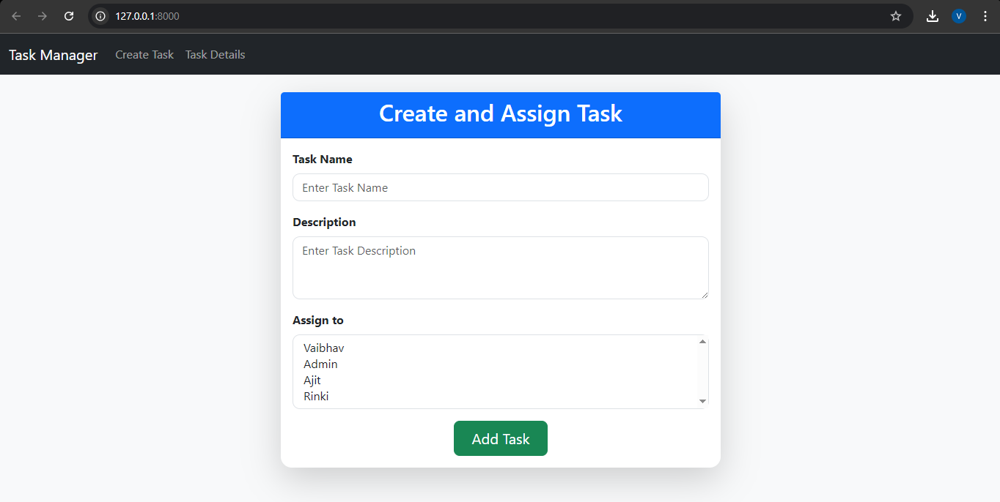
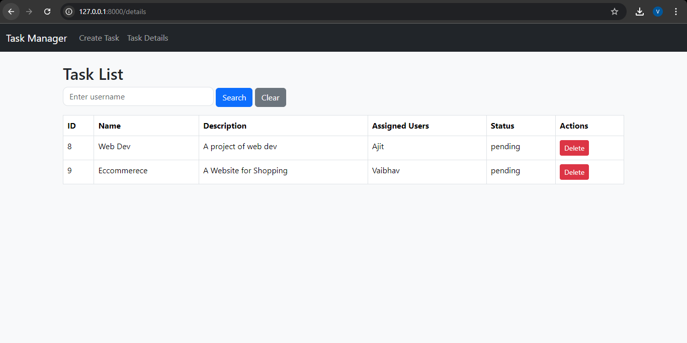

# 📝 Task Management API (Django & Django REST Framework)

This is a **Task Management API** built with **Django & Django REST Framework (DRF)** that allows users to:
- ✅ **Create tasks**
- ✅ **Assign tasks to multiple users**
- ✅ **Retrieve tasks assigned to specific users**
- ✅ **Secure the API using Token Authentication**

---
## 🚀 Github Link  
The Source Code is at: [https://github.com/vaibhav-singh05/Task-Manager](https://github.com/vaibhav-singh05/Task-Manager)

---

## 🛠 **Installation & Setup**
Follow these steps to set up the project:

### **1️⃣ Clone the Repository**
```sh
git clone <your_repo_url>
cd task_management
```

### **2️⃣ Create a Virtual Environment**
```sh
python -m venv venv
```
- **Activate it:**
  - **Windows:** `venv\Scripts\activate`
  - **Mac/Linux:** `source venv/bin/activate`

### **3️⃣ Install Dependencies**
```sh
pip install -r requirements.txt
```

### **4️⃣ Apply Database Migrations**
```sh
python manage.py migrate
```

### **5️⃣ Create a Superuser**
```sh
python manage.py createsuperuser
```
- Enter your **username, email, and password** when prompted.

### **6️⃣ Run the Development Server**
```sh
python manage.py runserver
```
- Now, open **http://127.0.0.1:8000/** in your browser.

---

## 🔑 **Authentication (Token-Based)**
This API uses **Token Authentication** to secure endpoints.

### **1️⃣ Get Authentication Token**
- **Make a POST request:**
  ```
  http://127.0.0.1:8000/api/token/
  ```
- **Body:**
  ```json
  {
      "username": "your_username",
      "password": "your_password"
  }
  ```
- **Response:**
  ```json
  {
      "token": "abcdef1234567890"
  }
  ```

### **2️⃣ Use the Token in API Requests**
Include the token in the request **headers**:
```
Authorization: Token abcdef1234567890
```
---

## 🚀 Live API Link  
The API is deployed at: [https://task-manager-a4jc.onrender.com](https://task-manager-a4jc.onrender.com)

---

## 📌 **API Endpoints**
| Method | Endpoint | Description |
|--------|---------|-------------|
| **GET** | `/api/tasks/` | Get all tasks |
| **POST** | `/api/tasks/` | Create a new task |
| **GET** | `/api/tasks/?user_id=<id>` | Get tasks assigned to a specific user |
| **DELETE** | `/api/tasks/<id>/` | Delete a task |

---

## Screenshots

### Home Page


### Task List


---

## 🔥 **Sample API Requests**
Here are some sample API requests using **cURL** and **Postman**.

### **1️⃣ Get All Tasks**
```sh
curl -X GET http://127.0.0.1:8000/api/tasks/ \
     -H "Authorization: Token abcdef1234567890"
```

### **2️⃣ Create a New Task**
```sh
curl -X POST http://127.0.0.1:8000/api/tasks/ \
     -H "Content-Type: application/json" \
     -H "Authorization: Token abcdef1234567890" \
     -d '{
           "name": "New Task",
           "description": "This is a new task"
         }'
```

### **3️⃣ Assign a Task to a User**
```sh
curl -X PATCH http://127.0.0.1:8000/api/tasks/1/ \
     -H "Content-Type: application/json" \
     -H "Authorization: Token abcdef1234567890" \
     -d '{
           "assigned_users": [2, 3]
         }'
```

### **4️⃣ Get Tasks Assigned to a Specific User**
```sh
curl -X GET http://127.0.0.1:8000/api/tasks/?user_id=2 \
     -H "Authorization: Token abcdef1234567890"
```

### **5️⃣ Delete a Task**
```sh
curl -X DELETE http://127.0.0.1:8000/api/tasks/1/ \
     -H "Authorization: Token abcdef1234567890"
```

---

## 🏗 **Project Structure**
```
Task-Manager/
├── task_manager/               # Root Django project directory
│   ├── __init__.py
│   ├── asgi.py
│   ├── settings.py             # Project settings
│   ├── urls.py                 # Root URL configurations
│   ├── wsgi.py
│
├── templates/                  # Global Templates Directory (for all apps)
│   ├── base.html
│   ├── tasks.html
│   ├── details.html
│
├── static/                     # Global Static Directory
│   ├── css/
│   │   ├── styles.css          # Main CSS file
│   ├── js/
│   ├── images/
│
├── tasks/                      # Main Django app
│   ├── migrations/             # Database migrations
│   │   └── __init__.py
│   ├── __init__.py
│   ├── admin.py                # Django Admin configurations
│   ├── apps.py                 # Django App configuration
│   ├── models.py               # Database models
│   ├── serializers.py          # Serializers for Django REST framework
│   ├── tests.py                # Test cases
│   ├── urls.py                 # Application-specific URL routing
│   ├── views.py                # View functions for the app
│
├── db.sqlite3                  # SQLite database file
├── manage.py                   # Django's CLI management script
├── requirements.txt            # List of dependencies
└── README.md                   # Project documentation

```

## ✨ **Contributing**
1. Fork the repo 🍴
2. Create a new branch 🌿
3. Commit your changes 🎯
4. Push to GitHub 🚀
5. Submit a **Pull Request** 💡

---

## 📞 **Support**
- **Author:** Vaibhav Singh  
- **Email:** vaibhavsingh273010@gmail.com  
- **LinkedIn:** [Click Here](https://www.linkedin.com/in/vaibhav-singh-2a5991229/)  

---

### 🎉 **Happy Coding! 🚀**
